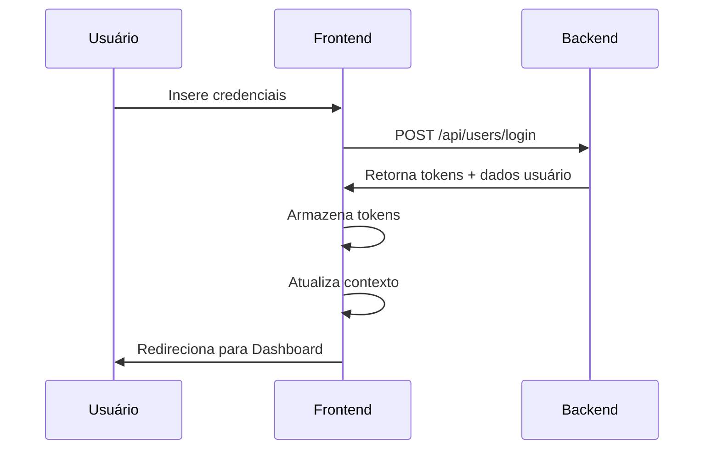
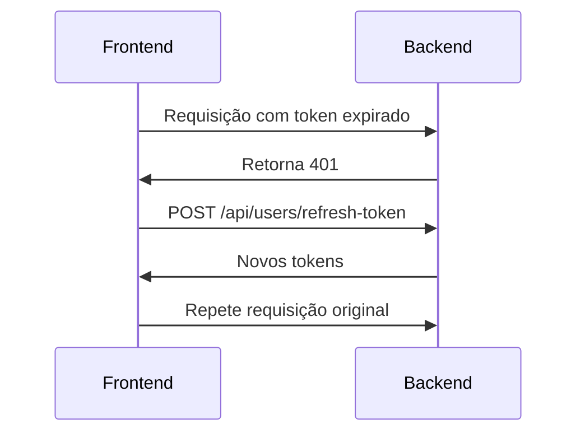

# Sistema de Autenticação - OdontoLegal

## Visão Geral

O sistema de autenticação do OdontoLegal é baseado em JWT (JSON Web Tokens) com um sistema de refresh token para manter a sessão do usuário de forma segura e proporcionar uma boa experiência de uso.

## Arquitetura

### Componentes Principais

1. **AuthContext (`src/contexts/AuthContext.jsx`)**

   - Gerenciamento de estado de autenticação
   - Provedor de métodos de autenticação
   - Controle de loading e erros

2. **API Service (`src/services/api.js`)**

   - Configuração do Axios
   - Interceptors para tokens
   - Renovação automática de tokens

3. **Protected Route (`src/routes/index.jsx`)**
   - HOC para proteção de rotas
   - Validação de permissões
   - Redirecionamento automático

## Fluxo de Autenticação Detalhado

### Login



### Renovação de Token



## Implementação

### Armazenamento de Tokens

```javascript
// Tokens no localStorage
@OdontoLegal:token        // Token de acesso
@OdontoLegal:refresh_token // Refresh token
```

### Interceptors

```javascript
// Request Interceptor
api.interceptors.request.use((config) => {
  const token = localStorage.getItem("@OdontoLegal:token");
  if (token) {
    config.headers.Authorization = `Bearer ${token}`;
  }
  return config;
});

// Response Interceptor
api.interceptors.response.use(
  (response) => response,
  async (error) => {
    if (error.response?.status === 401) {
      // Tenta renovar o token
      return refreshTokenAndRetry(error);
    }
    return Promise.reject(error);
  }
);
```

## Controle de Acesso

### Níveis de Usuário

1. **Admin**

   - Acesso total ao sistema
   - Gerenciamento de usuários
   - Configurações do sistema

2. **Perito**

   - Criação e edição de casos
   - Gestão de evidências
   - Geração de laudos

3. **Assistente**
   - Visualização de casos
   - Visualização de laudos
   - Acesso limitado a evidências

### Validação de Permissões

```javascript
const hasPermission = (permission) => {
  if (!user) return false;
  if (user.role === "admin") return true;

  const permissions = {
    perito: ["view_cases", "create_cases", "edit_cases"],
    assistente: ["view_cases", "view_reports"],
  };

  return permissions[user.role]?.includes(permission) || false;
};
```

## Segurança

### Medidas Implementadas

1. **Proteção de Tokens**

   - Armazenamento seguro
   - Renovação automática
   - Limpeza no logout

2. **Validações**

   - Verificação de tokens em cada requisição
   - Validação de permissões por rota
   - Sanitização de inputs

3. **Sessão**
   - Timeout automático
   - Renovação silenciosa
   - Logout em múltiplas falhas

### Boas Práticas

1. **Nunca armazenar dados sensíveis**

   - Senhas
   - Dados pessoais
   - Informações críticas

2. **Sempre usar HTTPS**

   - Comunicação segura
   - Certificados válidos
   - Headers de segurança

3. **Validação Constante**
   - Estado de autenticação
   - Permissões de usuário
   - Integridade dos dados

## Troubleshooting

### Problemas Comuns

1. **Token Expirado**

   - Causa: Tempo de vida do token excedido
   - Solução: Sistema de refresh automático
   - Fallback: Redirecionamento para login

2. **Permissão Negada**

   - Causa: Usuário sem acesso necessário
   - Solução: Verificação prévia de permissões
   - Feedback: Mensagem clara ao usuário

3. **Falha na Renovação**
   - Causa: Refresh token inválido/expirado
   - Solução: Logout e redirecionamento
   - Prevenção: Monitoramento de validade

## Melhorias Futuras

1. **Curto Prazo**

   - Implementar loading states
   - Melhorar mensagens de erro
   - Adicionar logs de auditoria

2. **Médio Prazo**

   - Autenticação em dois fatores
   - Single Sign-On (SSO)
   - Gestão de sessões múltiplas

3. **Longo Prazo**
   - Biometria (quando aplicável)
   - Análise de segurança avançada
   - Conformidade com normas específicas
